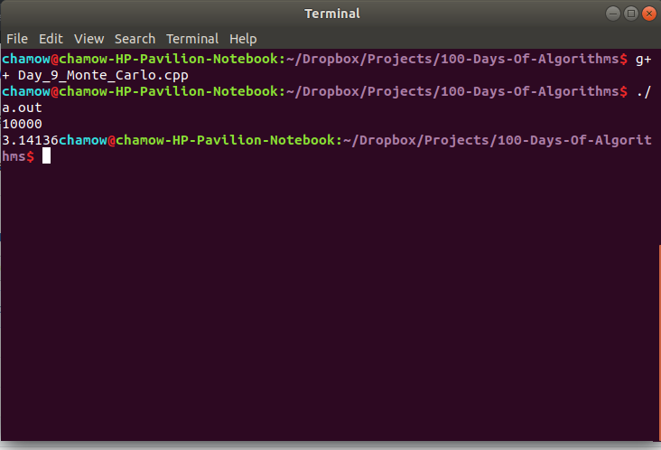

	<h1>
		100 Days of Algorithm
	</h1>
	 
	<h3>Introduction</h3>
	
This repository contains implementation of famous 100 Days of Algorithm which can be found here: <a href="https://medium.com/100-days-of-algorithms">link</a>

	 
	<h3>Log</h3>
	<h5>Day1 Hanoi Tower</h5>
	
Famous Towers of Hanoi Algorithm.

	
	 
	<h5>Day2 Matrix Chain Multiplication</h5>
	
Implementation of MCM.

	
	 
	<h5>Day3 Next Permutation</h5>
	
Implementation of Next Permutation Function.

	
	 
	<h5>Day4 Counting 1 bits</h5>
	
Count number of set bits.

	
	 
	<h5>Day5 Erastothenes Seive</h5>
	
Find number of primes.

	
	 
	<h5>Day6 Postfix Notation</h5>
	
Evaluation of postfix.

	
	 
	<h5>Day8 Binary Search</h5>
	
Searching a number O(lg N).

	
	 
	<h5>Day9 Monte Carlo</h5>
	
Finding PI value using randomized algorithm.

	
	 

